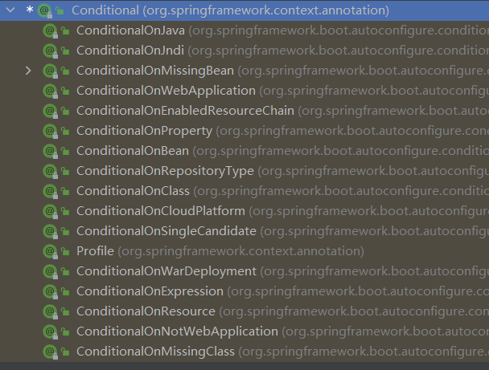
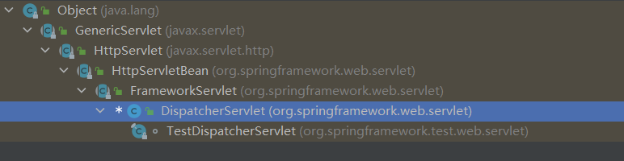
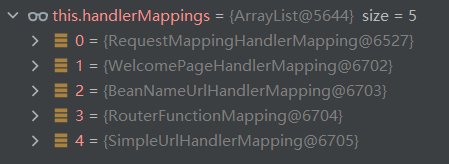
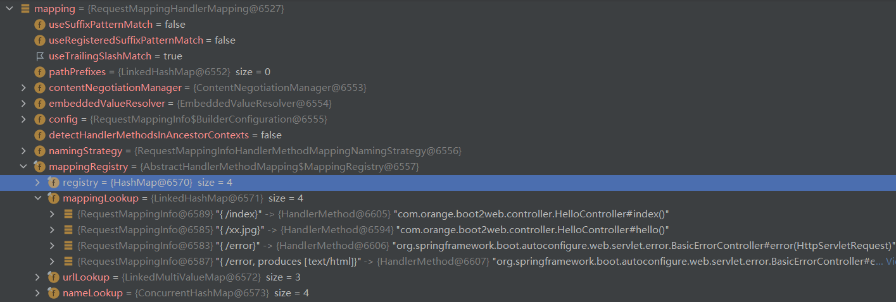
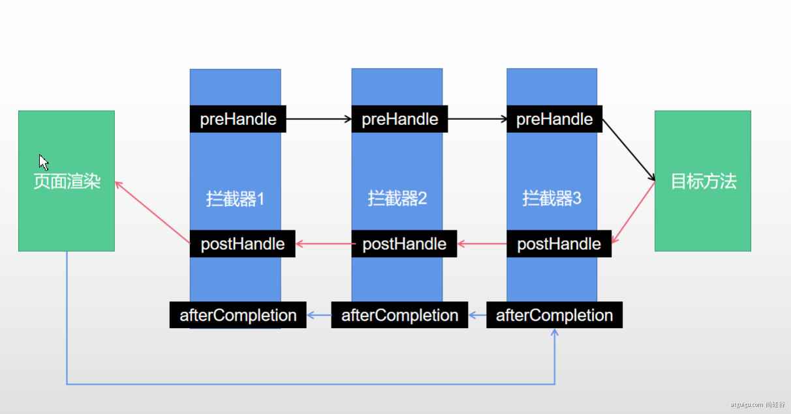

# Hello World
创建maven项目， 在pom.xml中添加依赖
```xml
<?xml version="1.0" encoding="UTF-8"?>
<project xmlns="http://maven.apache.org/POM/4.0.0" xmlns:xsi="http://www.w3.org/2001/XMLSchema-instance"
         xsi:schemaLocation="http://maven.apache.org/POM/4.0.0 https://maven.apache.org/xsd/maven-4.0.0.xsd">
    <modelVersion>4.0.0</modelVersion>
    <parent>
        <groupId>org.springframework.boot</groupId>
        <artifactId>spring-boot-starter-parent</artifactId>
        <version>2.3.9.RELEASE</version>
        <relativePath/> <!-- lookup parent from repository -->
    </parent>
    
    <groupId>com.orange</groupId>
    <artifactId>springboot2.0</artifactId>
    <version>0.0.1-SNAPSHOT</version>
    <name>springboot2.0</name>
    
    <properties>
        <java.version>1.8</java.version>
    </properties>
    
    <dependencies>
        <dependency>
            <groupId>org.springframework.boot</groupId>
            <artifactId>spring-boot-starter-web</artifactId>
        </dependency>

        <dependency>
            <groupId>org.springframework.boot</groupId>
            <artifactId>spring-boot-starter-test</artifactId>
            <scope>test</scope>
        </dependency>
    </dependencies>

    <build>
        <plugins>
            <plugin>
                <groupId>org.springframework.boot</groupId>
                <artifactId>spring-boot-maven-plugin</artifactId>
            </plugin>
        </plugins>
    </build>

</project>
```
编写主程序`com.orange.boot2.Application`
```java
@SpringBootApplication
public class Application {

    public static void main(String[] args) {
        SpringApplication.run(Application.class, args);
    }

}
```
编写示例`com.orange.boot2.controller.Hello`
```java
@RestController
public class Hello {

    @RequestMapping("/hello")
    public String hello() {
        return "Hello World!";
    }
}
```
运行主程序启动示例，打开浏览器访问 http://localhost:8080/hello
# 组件添加
## @Configuration
`@configuration`注解标注的类是一个配置类，同时也是一个组件。配置类相当于一个配置文件
SpringBoot2.0之后该注解多了个布尔类型的属性`proxyBeanMethods`，默认值为true。默认情况下spring会检查配置类中方法返回的组件在容器中有没有，没有就创建。当`proxyBeanMethods`的值为false时，spring不会检查配置类中方法返回的实例是否存在容器中，主要为了提升性能。
```java
@Configuration(proxyBeanMethods = false)
public class MyConfig {
    
}
```

## @Bean
`@Bean`注解是给容器中添加一个组件，在配置类中使用`@Bean`注册的组件默认是单实例的
```java
@Configuration
public class MyConfig {

    @Bean
    public User user() {
        return new User();
    }

}
```


## @Import
该注解的作用是导入一些特殊的Bean，一般为配置类，Spring中的配置一般都是自动导入的，通常用来导入第三方jar包中的配置类。
```java
@Import({OuterConfig.class})
public class MyConfig {

    @Bean
    public User user() {
        User user = new User();
        user.setName("name");
        return user;
    }
```
外部配置（第三方配置）
```java
@Configuration
public class OuterConfig {

    @Bean
    public Person person() {
        return new Person();
    }
}
```
# 
## @Conditional
条件装配，满足@Conditional指定的条件才装配组件


## @ImportResource
导入资源文件
```java
@Configuration(proxyBeanMethods = true)
@ImportResource("classpath:bean.xml")
public class MyConfig {

    @Bean
    public User user() {
        return user;
    }

}
```


# 配置绑定
## @ConfigurationProperties
使用`@ConfigurationProperties`读取前缀为person的属性值， 并用`@Component`注解装配到容器中，使用的时候`@AutoWired`注入

application.yml
```yaml
person:
  name: 谢金池
  age: 25
```
```java
@Component
@ConfigurationProperties(prefix = "person")
public class Person {
    private String name;
    private Integer age;

    public String getName() {
        return name;
    }

    public void setName(String name) {
        this.name = name;
    }

    public Integer getAge() {
        return age;
    }

    public void setAge(Integer age) {
        this.age = age;
    }
}
```


## @EnableConfigurationProperties+@ConfigurationProperties
@EnableConfigurationProperties注解标注在配置类上，会自动将组件注册到容器中，因此并不需要在组件上使用@Component注解
```java
@ConfigurationProperties(prefix = "person")
public class Person {
    private String name;
    private Integer age;

    public String getName() {
        return name;
    }

    public void setName(String name) {
        this.name = name;
    }

    public Integer getAge() {
        return age;
    }

    public void setAge(Integer age) {
        this.age = age;
    }
}
```
配置类
```java
@EnableConfigurationProperties(Person.class)
@Configuration(proxyBeanMethods = true)
public class MyConfig {
 
}
```


# 自动配置
## @SpringBootApplication
```java
@SpringBootConfiguration
@EnableAutoConfiguration
@ComponentScan(
    excludeFilters = {@Filter(
    type = FilterType.CUSTOM,
    classes = {TypeExcludeFilter.class}
), @Filter(
    type = FilterType.CUSTOM,
    classes = {AutoConfigurationExcludeFilter.class}
)}
)
public @interface SpringBootApplication {
```
`@SpringBootApplication`是一个复合注解，主要包含`@SpringBootConfiguration`和`@EnableAutoConfiguration`两个 注解。


## @SpringBootConfiguration
`@SpringBootConfiguration`这个注解标识当前是一个配置类


## @EnableAutoConfiguration
```java
@AutoConfigurationPackage
@Import({AutoConfigurationImportSelector.class})
public @interface EnableAutoConfiguration {
```
`@EnableAutoConfiguration`注解主要包含`@AutoConfigurationPackage`和`@Import`


### @AutoConfigurationPackage
```java
@Import({Registrar.class})
public @interface AutoConfigurationPackage {
```
`@AutoConfigurationPackage`包含`@Import`注解，会获取主类所在的包名，然后将包下的所有组件导入到容器中


### @Import({AutoConfigurationImportSelector.class})
`@Import({AutoConfigurationImportSelector.class})`是导入`AutoConfigurationImportSelector`类，默认扫描当前系统的所有`META-INF/spring.factories`位置的文件，文件里写了SpringBoot启动时要加载的所有配置类，当SpringBoot启动时就将这些配置类全部加载，然后按照条件装配。

# 配置文件YAML

- key: value；kv之间有空格
- 大小写敏感
- 使用缩进表示层级关系
- 缩进不允许使用tab，只允许空格
- 缩进的空格数不重要，只要相同层级的元素左对齐即可
- '#'表示注释
- 字符串无需加引号，如果要加，''与""表示字符串内容 会被 转义/不转义


yaml配置示例，java类
```java
@Data
public class Person {
    
    private String userName;
    private Boolean boss;
    private Date birth;
    private Integer age;
    private Pet pet;
    private String[] interests;
    private List<String> animal;
    private Map<String, Object> score;
    private Set<Double> salarys;
    private Map<String, List<Pet>> allPets;
}

@Data
public class Pet {
    private String name;
    private Double weight;
}
```
yaml文件
```yaml
person:
  userName: zhangsan
  boss: false
  birth: 2019/12/12 20:12:33
  age: 18
  pet: 
    name: tomcat
    weight: 23.4
  interests: [篮球,游泳]
  animal: 
    - jerry
    - mario
  score:
    english: 
      first: 30
      second: 40
      third: 50
    math: [131,140,148]
    chinese: {first: 128,second: 136}
  salarys: [3999,4999.98,5999.99]
  allPets:
    sick:
      - {name: tom}
      - {name: jerry,weight: 47}
    health: [{name: mario,weight: 47}]
```


## 配置提示
自定义的类和配置文件绑定一般没有提示，需要加上依赖spring-boot-configuration-processor
```xml
<dependency>
    <groupId>org.springframework.boot</groupId>
    <artifactId>spring-boot-configuration-processor</artifactId>
    <optional>true</optional>
</dependency>
```
打包的时候再将依赖spring-boot-configuration-processor去掉，在maven插件中配置
```xml
<project>
    <build>
        <plugins>
            <plugin>
                <groupId>org.springframework.boot</groupId>
                <artifactId>spring-boot-maven-plugin</artifactId>
                <configuration>
                    <excludes>
                        <exclude>
                            <groupId>org.springframework.boot</groupId>
                            <artifactId>spring-boot-configuration-processor</artifactId>
                        </exclude>
                    </excludes>
                </configuration>
            </plugin>
        </plugins>
    </build>
</project>
```


# web开发
## 静态资源
默认情况下，Spring Boot将静态资源放在类路径下：`/static` 、`/public`、`/resources`、`/META-INF/resources`，访问时使用项目名加静态资源名。


原理：请求来时先去找controller，如果controller不能处理，就交给静态资源处理器来处理，如果还是不能处理则返回404

可以通过配置来改变静态资源的位置，比如说放在类路径下的dist目录中
```yaml
spring:
  resources:
    static-locations: classpath:/dist
```


静态资源访问前缀：默认没有前缀，通过配置来添加前缀。
```yaml
spring:
  mvc:
    static-path-pattern: /resources/**
```


## 欢迎页

- 静态资源路径下  index.html
   - 可以配置静态资源路径
   - 但是不可以配置静态资源的访问前缀。否则导致index.html不能被默认访问


## favicon
favicon.ico 放在静态资源目录下即可。资源访问前缀也会导致favicon失效


## 请求处理
### Rest风格
SpringBoot支持Rest风格，但是需要手动开启，这种方式只适用于页面表单请求，前后端分离不需要配置。
```yaml
spring:
  mvc:
    hiddenmethod:
      filter:
        enabled: true
```
核心Filter是`HiddenHttpMethodFilter`，发送delete和put请求的时候需要在表单隐藏域中添加 _method=put（delete）


### 请求映射
SpringMVC功能分析都从 org.springframework.web.servlet.DispatcherServlet->doDispatch()

 

```java
protected void doDispatch(HttpServletRequest request, HttpServletResponse response) throws Exception {
        HttpServletRequest processedRequest = request;
        HandlerExecutionChain mappedHandler = null;
        boolean multipartRequestParsed = false;

        WebAsyncManager asyncManager = WebAsyncUtils.getAsyncManager(request);

        try {
            ModelAndView mv = null;
            Exception dispatchException = null;

            try {
                processedRequest = checkMultipart(request);
                multipartRequestParsed = (processedRequest != request);

                // 找到当前请求使用哪个Handler（Controller的方法）处理
                mappedHandler = getHandler(processedRequest);
```
默认有五个HandlerMapping

 

`RequestMappingHandlerMapping`：保存了所有@RequestMapping 和handler的映射规则。

 

所有的请求映射都在HandlerMapping中。

- SpringBoot自动配置欢迎页的 WelcomePageHandlerMapping 。访问 /能访问到index.html；
- SpringBoot自动配置了默认 的 RequestMappingHandlerMapping
- 请求进来，挨个尝试所有的HandlerMapping看是否有请求信息。
   - 如果有就找到这个请求对应的handler
   - 如果没有就是下一个 HandlerMapping


## 参数处理
### 注解：
@PathVariable、@RequestHeader、@ModelAttribute、@RequestParam、@MatrixVariable、@CookieValue、@RequestBody
```java
@RestController
public class ParameterTestController {


    //  car/2/owner/zhangsan
    @GetMapping("/car/{id}/owner/{username}")
    public Map<String,Object> getCar(@PathVariable("id") Integer id,
                                     @PathVariable("username") String name,
                                     @PathVariable Map<String,String> pv,
                                     @RequestHeader("User-Agent") String userAgent,
                                     @RequestHeader Map<String,String> header,
                                     @RequestParam("age") Integer age,
                                     @RequestParam("inters") List<String> inters,
                                     @RequestParam Map<String,String> params,
                                     @CookieValue("_ga") String _ga,
                                     @CookieValue("_ga") Cookie cookie){


        Map<String,Object> map = new HashMap<>();

//        map.put("id",id);
//        map.put("name",name);
//        map.put("pv",pv);
//        map.put("userAgent",userAgent);
//        map.put("headers",header);
        map.put("age",age);
        map.put("inters",inters);
        map.put("params",params);
        map.put("_ga",_ga);
        System.out.println(cookie.getName()+"===>"+cookie.getValue());
        return map;
    }


    @PostMapping("/save")
    public Map postMethod(@RequestBody String content){
        Map<String,Object> map = new HashMap<>();
        map.put("content",content);
        return map;
    }


    //1、语法： 请求路径：/cars/sell;low=34;brand=byd,audi,yd
    //2、SpringBoot默认是禁用了矩阵变量的功能
    //      手动开启：原理。对于路径的处理。UrlPathHelper进行解析。
    //              removeSemicolonContent（移除分号内容）支持矩阵变量的
    //3、矩阵变量必须有url路径变量才能被解析
    @GetMapping("/cars/{path}")
    public Map carsSell(@MatrixVariable("low") Integer low,
                        @MatrixVariable("brand") List<String> brand,
                        @PathVariable("path") String path){
        Map<String,Object> map = new HashMap<>();

        map.put("low",low);
        map.put("brand",brand);
        map.put("path",path);
        return map;
    }

    // /boss/1;age=20/2;age=10

    @GetMapping("/boss/{bossId}/{empId}")
    public Map boss(@MatrixVariable(value = "age",pathVar = "bossId") Integer bossAge,
                    @MatrixVariable(value = "age",pathVar = "empId") Integer empAge){
        Map<String,Object> map = new HashMap<>();

        map.put("bossAge",bossAge);
        map.put("empAge",empAge);
        return map;

    }

}
```
### Servlet API：
WebRequest、ServletRequest、MultipartRequest、 HttpSession、javax.servlet.http.PushBuilder、Principal、InputStream、Reader、HttpMethod、Locale、TimeZone、ZoneId

**ServletRequestMethodArgumentResolver  以上的部分参数**
```java
@Override
	public boolean supportsParameter(MethodParameter parameter) {
		Class<?> paramType = parameter.getParameterType();
		return (WebRequest.class.isAssignableFrom(paramType) ||
				ServletRequest.class.isAssignableFrom(paramType) ||
				MultipartRequest.class.isAssignableFrom(paramType) ||
				HttpSession.class.isAssignableFrom(paramType) ||
				(pushBuilder != null && pushBuilder.isAssignableFrom(paramType)) ||
				Principal.class.isAssignableFrom(paramType) ||
				InputStream.class.isAssignableFrom(paramType) ||
				Reader.class.isAssignableFrom(paramType) ||
				HttpMethod.class == paramType ||
				Locale.class == paramType ||
				TimeZone.class == paramType ||
				ZoneId.class == paramType);
	}
```


# 拦截器
拦截器需要实现**HandlerInterceptor**接口。 例如：写一个登录检查
```java
/**
 * 登录检查
 * 1、配置好拦截器要拦截哪些请求
 * 2、把这些配置放在容器中
 */
@Slf4j
public class LoginInterceptor implements HandlerInterceptor {

    /**
     * 目标方法执行之前
     * @param request
     * @param response
     * @param handler
     * @return
     * @throws Exception
     */
    @Override
    public boolean preHandle(HttpServletRequest request, HttpServletResponse response, Object handler) throws Exception {

        String requestURI = request.getRequestURI();
        log.info("preHandle拦截的请求路径是{}",requestURI);

        //登录检查逻辑
        HttpSession session = request.getSession();

        Object loginUser = session.getAttribute("loginUser");

        if(loginUser != null){
            //放行
            return true;
        }

        //拦截住。未登录。跳转到登录页
        request.setAttribute("msg","请先登录");
//        re.sendRedirect("/");
        request.getRequestDispatcher("/").forward(request,response);
        return false;
    }

    /**
     * 目标方法执行完成以后
     * @param request
     * @param response
     * @param handler
     * @param modelAndView
     * @throws Exception
     */
    @Override
    public void postHandle(HttpServletRequest request, HttpServletResponse response, Object handler, ModelAndView modelAndView) throws Exception {
        log.info("postHandle执行{}",modelAndView);
    }

    /**
     * 页面渲染以后
     * @param request
     * @param response
     * @param handler
     * @param ex
     * @throws Exception
     */
    @Override
    public void afterCompletion(HttpServletRequest request, HttpServletResponse response, Object handler, Exception ex) throws Exception {
        log.info("afterCompletion执行异常{}",ex);
    }
}
```
配置拦截器
```java
/**
 * 1、编写一个拦截器实现HandlerInterceptor接口
 * 2、拦截器注册到容器中（实现WebMvcConfigurer的addInterceptors）
 * 3、指定拦截规则【如果是拦截所有，静态资源也会被拦截】
 */
@Configuration
public class AdminWebConfig implements WebMvcConfigurer {

    @Override
    public void addInterceptors(InterceptorRegistry registry) {
        registry.addInterceptor(new LoginInterceptor())
                .addPathPatterns("/**")  //所有请求都被拦截包括静态资源
                .excludePathPatterns("/","/login","/css/**","/fonts/**","/images/**","/js/**"); //放行的请求
    }
}
```
## 拦截器原理
1. 根据当前请求，找到 **HandlerExecutionChain** 可以处理请求的handler以及handler的所有 拦截器
2. 先来 **顺序执行**  所有拦截器的 preHandle方法
   1. 如果当前拦截器prehandler返回为true。则执行下一个拦截器的preHandle
   2. 如果当前拦截器返回为false。直接    倒序执行所有已经执行了的拦截器的  afterCompletion

3. 如果任何一个拦截器返回false。直接跳出不执行目标方法
4. 所有拦截器都返回True。执行目标方法
5. 倒序执行所有拦截器的postHandle方法。
6. 前面的步骤有任何异常都会直接倒序触发 afterCompletion
7. 页面成功渲染完成以后，也会倒序触发 afterCompletion

 


# 全局异常处理
执行Controller方法出现异常时触发
```java
@RestControllerAdvice
public class GlobalExceptionHandler {

    @ExceptionHandler(value = Exception.class)
    public String exceptionHandler(Exception e) {
        e.printStackTrace();
        return "系统错误:" + e.getMessage();
    }
}
```


# 指标监控
## SpringBoot Actuator
未来每一个微服务在云上部署以后，我们都需要对其进行监控、追踪、审计、控制等。SpringBoot就抽取了Actuator场景，使得我们每个微服务快速引用即可获得生产级别的应用监控、审计等功能。
```xml
<dependency>
    <groupId>org.springframework.boot</groupId>
    <artifactId>spring-boot-starter-actuator</artifactId>
</dependency>
```
配置
```yaml
management:
  endpoints:
    enabled-by-default: true #暴露所有端点信息
    web:
      exposure:
        include: '*'  #以web方式暴露
```
测试：
[http://localhost:8080/actuator](http://localhost:8080/actuator)

## Actuator Endpoint
最常用的Endpoint

- **Health：监控状况**
- **Metrics：运行时指标**
- **Loggers：日志记录**


### Health Endpoint
健康检查端点，我们一般用于在云平台，平台会定时的检查应用的健康状况，我们就需要Health Endpoint可以为平台返回当前应用的一系列组件健康状况的集合。
重要的几点：

- health endpoint返回的结果，应该是一系列健康检查后的一个汇总报告
- 很多的健康检查默认已经自动配置好了，比如：数据库、redis等
- 可以很容易的添加自定义的健康检查机制


配置显示详细信息
```yaml
management:
  endpoint:
    health:
      show-details: always
```
测试：[http://localhost:8080/actuator/health](http://localhost:8080/actuator/health)


### Metrics Endpoint
提供详细的、层级的、空间指标信息，这些信息可以被pull（主动推送）或者push（被动获取）方式得到；

- 通过Metrics对接多种监控系统
- 简化核心Metrics开发
- 添加自定义Metrics或者扩展已有Metrics


##  可视化监控
[https://github.com/codecentric/spring-boot-admin](https://github.com/codecentric/spring-boot-admin)


# Profile
为了方便多环境适配，springboot简化了profile功能。

- 默认配置文件  application.yaml；任何时候都会加载
- 指定环境配置文件  application-{env}.yaml
- 激活指定环境
   - 配置文件激活
   - 命令行激活：java -jar xxx.jar --**spring.profiles.active=prod  --person.name=haha**
      - **修改配置文件的任意值，命令行优先**
- 默认配置与环境配置同时生效
- 同名配置项，profile配置优先


## 配置文件查找位置

1. classpath 根路径
1. classpath 根路径下config目录
1. jar包当前目录
1. jar包当前目录的config目录
1. /config子目录的直接子目录


## 配置文件加载顺序

1. 当前jar包内部的application.properties和application.yml
1. 当前jar包内部的application-{profile}.properties 和 application-{profile}.yml
1. 引用的外部jar包的application.properties和application.yml
1. 引用的外部jar包的application-{profile}.properties 和 application-{profile}.yml


# 自定义starter
自定义starter分为两个部分，分别是**启动器**和**配置包，**启动器依赖配置包。


启动器：**hello-spring-boot-starter**，只包含配置包，不写代码
pom.xml
```xml
<?xml version="1.0" encoding="UTF-8"?>
<project xmlns="http://maven.apache.org/POM/4.0.0"
         xmlns:xsi="http://www.w3.org/2001/XMLSchema-instance"
         xsi:schemaLocation="http://maven.apache.org/POM/4.0.0 http://maven.apache.org/xsd/maven-4.0.0.xsd">
    <modelVersion>4.0.0</modelVersion>

    <groupId>org.orange</groupId>
    <artifactId>hello-spring-boot-starter</artifactId>
    <version>1.0-SNAPSHOT</version>

    <properties>
        <maven.compiler.source>8</maven.compiler.source>
        <maven.compiler.target>8</maven.compiler.target>
    </properties>

    <dependencies>
        <dependency>
            <groupId>com.orange</groupId>
            <artifactId>hello-spring-boot-starter-autoconfigure</artifactId>
            <version>0.0.1-SNAPSHOT</version>
        </dependency>
    </dependencies>

</project>
```
配置包：**hello-spring-boot-starter-autoconfigure**，配置包有配置类、配置属性类、`META-INF/spring.factories`和业务代码
pom.xml
```xml
<?xml version="1.0" encoding="UTF-8"?>
<project xmlns="http://maven.apache.org/POM/4.0.0" xmlns:xsi="http://www.w3.org/2001/XMLSchema-instance"
         xsi:schemaLocation="http://maven.apache.org/POM/4.0.0 https://maven.apache.org/xsd/maven-4.0.0.xsd">
    <modelVersion>4.0.0</modelVersion>
    <parent>
        <groupId>org.springframework.boot</groupId>
        <artifactId>spring-boot-starter-parent</artifactId>
        <version>2.3.9.RELEASE</version>
        <relativePath/> <!-- lookup parent from repository -->
    </parent>
    <groupId>com.orange</groupId>
    <artifactId>hello-spring-boot-starter-autoconfigure</artifactId>
    <version>0.0.1-SNAPSHOT</version>

    <properties>
        <java.version>1.8</java.version>
    </properties>

    <dependencies>
        <dependency>
            <groupId>org.springframework.boot</groupId>
            <artifactId>spring-boot-starter</artifactId>
        </dependency>

    </dependencies>

</project>

```
配置类：**HelloServiceAutoConfiguration**
```java
@Configuration
@EnableConfigurationProperties({HelloProperties.class})
public class HelloServiceAutoConfiguration {

    @Bean
    @ConditionalOnMissingBean({HelloService.class})
    public HelloService helloService() {
        HelloService helloService = new HelloService();
        return helloService;
    }
}
```
配置属性类：**HelloProperties**
```java
@ConfigurationProperties(prefix = "orange.hello")
public class HelloProperties {
    private String name;

    public String getName() {
        return name;
    }

    public void setName(String name) {
        this.name = name;
    }
}
```
**META-INF/spring.factories文件**
```java
org.springframework.boot.autoconfigure.EnableAutoConfiguration=\
com.orange.hello.auto.HelloServiceAutoConfiguration
```
业务类：**HelloService**
```java
@Service
public class HelloService {

    @Autowired
    private HelloProperties helloProperties;

    public String sayHello() {
        return "hello:" + helloProperties.getName();
    }
}
```
测试 ， 新建项目，引入自定义的starter，注入HelloService，在配置文件中配置`orange.hello.name`
