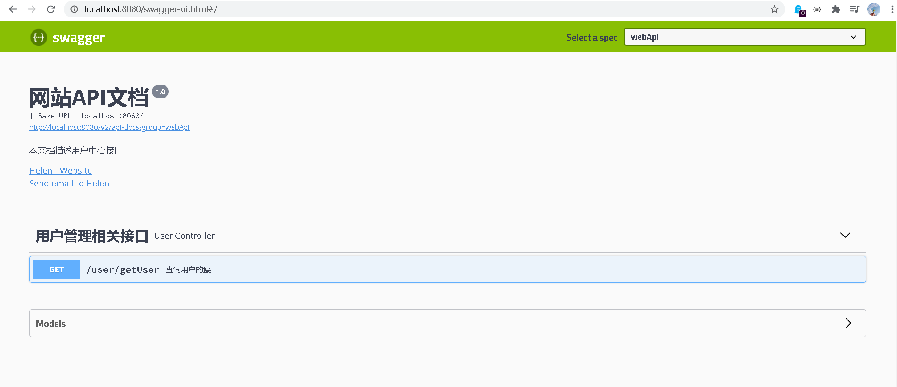

## Swagger2介绍


前后端分离开发模式中，api文档是最好的沟通方式。


Swagger 是一个规范和完整的框架，用于生成、描述、调用和可视化 RESTful 风格的 Web 服务。


1. 及时性 (接口变更后，能够及时准确地通知相关前后端开发人员)
1. 规范性 (并且保证接口的规范性，如接口的地址，请求方式，参数及响应格式和错误信息)
1. 一致性 (接口信息一致，不会出现因开发人员拿到的文档版本不一致，而出现分歧)
1. 可测性 (直接在接口文档上进行测试，以方便理解业务)


## 加入依赖


```xml
<dependency>
    <groupId>io.springfox</groupId>
    <artifactId>springfox-swagger2</artifactId>
    <scope>provided</scope>
</dependency>
<dependency>
    <groupId>io.springfox</groupId>
    <artifactId>springfox-swagger-ui</artifactId>
    <scope>provided</scope>
</dependency>
```


## 添加配置


首先要在配置类上加上@EnableSwagger2注解开启Swagger2


然后在配置类中添加swagger2的配置


```java
@Bean
public Docket webApiConfig() {
    return new Docket(DocumentationType.SWAGGER_2)
            .groupName("webApi").apiInfo(webApiInfo())
            .select().paths(Predicates.not(PathSelectors.regex("/admin/.*")))
            .paths(Predicates.not(PathSelectors.regex("/error.*")))
            .build();
}

private ApiInfo webApiInfo() {
    return new ApiInfoBuilder()
            .title("网站API文档")
            .description("本文档描述用户中心接口")
            .version("1.0")
            .contact(new Contact("Helen", "http://baidu.com", "lemonxe@qq.com"))
            .build();
}
```


## API模型


可以添加一些自定义设置，
例如：定义样例数据


```java
@ApiModelProperty(value = "创建时间", example = "2019-01-01 8:00:00")
@TableField(fill = FieldFill.INSERT)
private Date gmtCreate;

@ApiModelProperty(value = "更新时间", example = "2019-01-01 8:00:00")
@TableField(fill = FieldFill.INSERT_UPDATE)
private Date gmtModified;
```


## 定义接口说明和参数说明


`@Api`: 定义在类上
`@ApiOperation`: 定义在方法上
`@ApiParam`: 定义在参数上


```java
@Api(description="讲师管理")
@RestController@RequestMapping("/admin/edu/teacher")
public class TeacherAdminController {
    
    @Autowiredprivate TeacherService teacherService;
    
    @ApiOperation(value = "所有讲师列表")
    @GetMappingpublic List<Teacher> list(){
        return teacherService.list(null);}
    
    @ApiOperation(value = "根据ID删除讲师")
    @DeleteMapping("{id}")
    public boolean removeById(
        	@ApiParam(name = "id", value = "讲师ID", required = true)
        	@PathVariable String id){
        
        return teacherService.removeById(id);
    }
}
```


## 测试swagger2


启动服务, 打开浏览器访问 [http://localhost:8080/swagger-ui.html](http://localhost:8080/swagger-ui.html)


看到如下图说明接入swagger2成功




