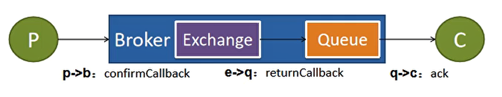

# SpringBoot整合RabbitMQ


加入依赖
```xml
<dependency>
    <groupId>org.springframework.boot</groupId>
    <artifactId>spring-boot-starter-amqp</artifactId>
</dependency>
```


application.yml配置
```yaml
spring:
  rabbitmq:
    host: localhost
    port: 5672
    virtual-host: /
```


在配置类上加上注解@EnableRabbit开启RabbitMQ
```java
@EnableRabbit
@SpringBootApplication
public class RabbitmqApplication {

    public static void main(String[] args) {
        SpringApplication.run(RabbitmqTestApplication.class, args);
    }
}
```


创建消息队列（queue）、交换机（exchange）、绑定（binding）。


将交换机、队列和绑定装配到容器中，如果RabbitMQ中没有就会自动创建，但是修改交换机和队列的属性再重启项目，已经创建好的交换机和队列的属性不会改变。
```java
@Configuration
public class RabbitConfig {

    /**
     * 设置消息序列化为json格式传输
     *
     * @return
     */
    @Bean
    public MessageConverter messageConverter() {
        return new Jackson2JsonMessageConverter();
    }

    /**
     * 创建队列
     *
     * @return queue
     */
    @Bean
    public Queue userQueue() {
        /**
         * 创建队列的构造方法
         * Queue(String name, boolean durable, boolean exclusive, boolean autoDelete, @Nullable Map<String, Object> arguments)
         * name：队列的名字
         * durable：是否持久化
         * exclusive：是否排他
         * autoDelete：是否自动删除
         * arguments：自定义属性
         */
        Queue queue = new Queue("orange.user.queue", true, false, false, null);
        return queue;
    }

    /**
     * 创建交换机
     *
     * @return exchange
     */
    @Bean
    public Exchange userExChange() {

        /**
         * 创建主题交换机的构造方法
         * TopicExchange(String name, boolean durable, boolean autoDelete, Map<String, Object> arguments)
         * name：交换机的名字
         * durable：是否持久化
         * autoDelete：是否自动删除
         * arguments：自定义属性
         */
        return new TopicExchange("orange-user-exchange", true, false, null);
    }

    @Bean
    public Binding userBinding() {
        /**
         * 创建绑定的构造方法
         * Binding(String destination, Binding.DestinationType destinationType, String exchange, String routingKey, @Nullable Map<String, Object> arguments)
         * destination：目的地，就是队列的名字
         * destinationType：目的地类型
         * exchange：交换机名字
         * routingKey：路由键
         *
         */
        return new Binding("orange.user.queue", Binding.DestinationType.QUEUE, "orange-user-exchange", "orange.user", null);
    }
}

```


发送消息
使用 RabbitTemplate 发送消息，指定 exchange 和 routeKey
```java
    @Autowired
    private RabbitTemplate rabbitTemplate;

    @Override
    public void sendMQ(UserDTO userDTO) {
        //给mq发消息
         rabbitTemplate.convertAndSend("orange-user-exchange", "orange.user", userDTO);
    }
```


接收消息
监听消息常用两种方式

- 使用@RabbitListener 注解标注在方法上，注解属性queue是要监听的队列，是一个数组，可以监听多个队列。
- 使用@RabbitListener、@RabbitHandler，@RabbitListener标注在类上，@RabbitHandler标注在方法上，可以使用不同方法接收同一个队列中不同的消息。


方式一：使用@RabbitListener
```java
/**
 * RabbitListener(queues = {"orange.user.queue"})
 * 注解属性：queues 需要监听的队列，是一个数组，可以监听多个队列
 *
 * @param message 原生消息详细信息，包括消息头、消息体。
 * @param userDTO 发送的消息类型。
 * @param channel 当前传输数据的通道
 */
@RabbitListener(queues = {"orange.user.queue"})
public void consumerMassage(Message message, UserDTO userDTO, Channel channel) {
    log.info("收到消息：{}", userDTO);
}
```


方式二：使用@RabbitListener、@RabbitHandler
```java
@RabbitListener(queues = {"orange.user.queue"})
@Slf4j
@Service
public class MessageUserServiceImpl extends ServiceImpl<MessageUserMapper, MessageUser> implements MessageUserService {


    /**
     * 注解属性：queues 需要监听的队列，是一个数组，可以监听多个队列
     *
     * @param message 原生消息详细信息，包括消息头、消息体。
     * @param userDTO 发送的消息类型。
     * @param channel 当前传输数据的通道
     */
    @RabbitHandler
    public void userDTOMassage(Message message, UserDTO userDTO, Channel channel) {
        log.info("收到消息：{}", userDTO);
    }

    /**
     * @param user 发送的消息类型
     */
    @RabbitHandler
    public void userMessage(User user) {
        log.info("收到消息：{}", user);
    }
}
```


# RabbitMQ消息丢失问题


首先了解一下RabbitMQ的工作流程

1. 消息发送者把消息发送给RabbitMQ服务器Broker
1. 交换机（exchange）把消息按照指定的路由键（routeKey）发给相应的队列（queue）
1. 队列把消息发送给消息监听者


 


**消息丢失问题**

**问题一：**消息没有到达RabbitMQ服务器
生产者把消息发给RabbitMQ的时候，可能由于网络或者其他原因，消息没有到达RabbitMQ服务器。
解决方法
方法一：开启事务机制。生产者发送消息之前开启RabbitMQ事务，如果消息没有成功被RabbitMQ收到，生产者就会收到异常信息。但是开启事务机制会使性能下降250倍。
方法二：发送方确认(publisher confirm)机制。消息到达服务器时触发回调方法


**问题二：**RabbitMQ收到消息后丢失了消息
RabbitMQ收到消息后，此时服务器突然挂掉，内存里的消息丢失。
解决方法：开启RabbitMQ持久化


**问题三：**消费者丢失消息
消费者收到消息后，还没执行完业务服务就挂掉。
解决方法：开启RabbitMQ手动ACK，确认消费消息。


## 发送方确认机制
**
消息抵达服务器确认 publisher-confirm-type: _correlated，该属性有三个取值_

- none：表示禁用发布确认模式，默认即此。
- correlated：表示成功发布消息到交换器后会触发的回调方法。
- simple：类似 correlated，并且支持 waitForConfirms() 和 waitForConfirmsOrDie() 方法的调用。

消息没有成功到达队列回调 publisher-returns: true
```yaml
spring:
  rabbitmq:
    host: localhost
    port: 5672
    virtual-host: /
    #消息抵达服务器确认
    publisher-confirm-type: correlated
    #消息没有到达队列确认
    publisher-returns: true
    template:
      #只要消息抵达队列，以异步优先回调 returns
      mandatory: true
```


定制RabbitTemplate，配置两个 Callback。
```java
@Slf4j
@Configuration
public class RabbitConfig {


    @Autowired
    private RabbitTemplate rabbitTemplate;

    /**
     * 定制 RabbitTemplate
     * <p>
     * PostConstruct ：RabbitConfig对象创建完成之后执行这个方法
     */
    @PostConstruct
    public void initRabbitTemplate() {

        /**
         * 设置消息到达服务器确认回调
         */
        rabbitTemplate.setConfirmCallback(new RabbitTemplate.ConfirmCallback() {
            /**
             *
             * @param correlationData 当前消息的唯一关联数据（消息的唯一ID）
             * @param ack 交换机是否成功收到消息
             * @param cause 失败信息
             */
            @Override
            public void confirm(CorrelationData correlationData, boolean ack, String cause) {
                log.info("消息ID：{}，消息是否到达Broker：{}，失败信息：{}", correlationData, ack, cause);
            }
        });

        /**
         * 消息没有抵达队列的回调
         */
        rabbitTemplate.setReturnCallback(new RabbitTemplate.ReturnCallback() {
            /**
             * 消息没有投递给指定的队列，就会触发这个方法
             *
             * @param message 投递失败的消息详细信息
             * @param replyCode 回复的状态码
             * @param replyText 回复的文本内容
             * @param exchange 目标交换机
             * @param routingKey 使用的路由键
             */
            @Override
            public void returnedMessage(Message message, int replyCode, String replyText, String exchange, String routingKey) {
                log.info("失败消息的信息：{}，状态码：{}，文本内容：{}，目标交换机：{}，使用的路由键：{}", message, replyCode, replyText, exchange, routingKey);
            }
        });
    }

    /**
     * 设置消息序列化为json格式传输
     *
     * @return
     */
    @Bean
    public MessageConverter messageConverter() {
        return new Jackson2JsonMessageConverter();
    }
}
```


## 消费方确认机制


保证消息被正确消费，消息才从队列中删除。默认是自动确认的，只要消费端收到消息，服务端就会移除这个消息。


开启消费端手动ack确认
```yaml
spring:
  rabbitmq:
    host: localhost
    port: 5672
    virtual-host: /
    #消息抵达服务器确认
    publisher-confirm-type: correlated
    #消息没有到达队列确认
    publisher-returns: true
    template:
      #只要消息抵达队列，以异步优先回调 returns
      mandatory: true
    listener:
      simple:
        #开启消费端手动确认
        acknowledge-mode: manual
```


确认消费、拒绝消费


确认消费一个方法：
```java
/*
    deliveryTag：消息的头部属性信息，channel内按顺序自增
    multiple：是否批量确认
*/
void basicAck(long deliveryTag, boolean multiple)
```


拒绝消费的方法：
```java
/*
    deliveryTag：消息的头部属性信息，channel内按顺序自增
    multiple：是否批量拒绝
    requeue：拒绝后是否放入队列  true 从新发回服务器，false 丢弃消息
*/
void basicNack(long deliveryTag, boolean multiple, boolean requeue)
    
/*
    deliveryTag：消息的头部属性信息，channel内按顺序自增
    requeue：拒绝后是否放入队列  true 从新发回服务器，false 丢弃消息
*/    
void basicReject(long deliveryTag, boolean requeue) throws IOException;
```


手动确认消费
```java
@RabbitHandler
public void userMessage(Message message, User user, Channel channel) {

    //消息头信息
    MessageProperties messageProperties = message.getMessageProperties();
    //channel内按顺序从1递增
    long deliveryTag = message.getMessageProperties().getDeliveryTag();
    log.info("收到消息：{}", user);
    try {
        //确认消费消息
        channel.basicAck(deliveryTag, false);
    } catch (IOException e) {
        e.printStackTrace();
    }

}
```


