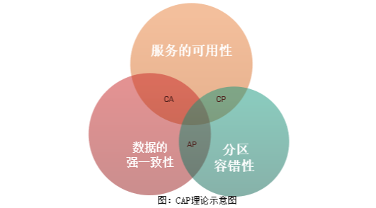

# 事务的基本性质
数据库事务的几个特性：原子性（Atomicity）、一致性（Consistency）、隔离性或独立性（Isolation）和持久性（Durability），简称ACID。

- 原子性：一系列操作整体不可拆分，要么同时成功，要么同时失败。
- 一致性：在事务完成时，数据都保持一致状态。
- 隔离性：指一个事务的执行不能被其他事务干扰，即一个事务内部的操作及使用的数据对并发的其他事务是隔离的，并发执行的各个事务之间不能互相干扰。
- 永久性：指一个事务一旦提交，它对数据库中的数据的改变就应该是永久性的。


# 事务的并发问题
在实际应用中，数据库中的数据是要被多个用户共同访问的，在多个用户同时操作相同的数据时，可能就会出现一些事务的并发问题，具体如下。

**脏读**
指一个事务读取到另一个事务未提交的数据。
**不可重复读**
指一个事务对同一行数据重复读取两次，但得到的结果不同。
**虚读/幻读**
指一个事务执行两次查询，但第二次查询的结果包含了第一次查询中未出现的数据。
**丢失更新**
指两个事务同时更新一行数据，后提交（或撤销）的事务将之前事务提交的数据覆盖了。

丢失更新可分为两类，分别是第一类丢失更新和第二类丢失更新。

- 第一类丢失更新是指两个事务同时操作同一个数据时，当第一个事务撤销时，把已经提交的第二个事务的更新数据覆盖了，第二个事务就造成了数据丢失。
- 第二类丢失更新是指当两个事务同时操作同一个数据时，第一个事务将修改结果成功提交后，对第二个事务已经提交的修改结果进行了覆盖，对第二个事务造成了数据丢失。


# 事务的隔离级别
为了避免事务并发问题的出现，在标准的 SQL 规范中定义了四种事务隔离级别，不同的隔离级别对事务的处理有所不同。这四种事务的隔离级别如下。

**Read Uncommitted（读未提交）**
一个事务在执行过程中，既可以访问其他事务未提交的新插入的数据，又可以访问未提交的修改数据。如果一个事务已经开始写数据，则另外一个事务不允许同时进行写操作，但允许其他事务读此行数据。此隔离级别可防止丢失更新。

**Read Committed（读已提交）**
一个事务在执行过程中，既可以访问其他事务成功提交的新插入的数据，又可以访问成功修改的数据。读取数据的事务允许其他事务继续访问该行数据，但是未提交的写事务将会禁止其他事务访问该行。此隔离级别可有效防止脏读。

**Repeatable Read（可重复读取）**
一个事务在执行过程中，可以访问其他事务成功提交的新插入的数据，但不可以访问成功修改的数据。读取数据的事务将会禁止写事务（但允许读事务），写事务则禁止任何其他事务。此隔离级别可有效防止不可重复读和脏读。

**Serializable（可串行化）**
提供严格的事务隔离。它要求事务序列化执行，事务只能一个接着一个地执行，不能并发执行。此隔离级别可有效防止脏读、不可重复读和幻读。但这个级别可能导致大量的超时现象和锁竞争，在实际应用中很少使用。


一般来说，事务的隔离级别越高，越能保证数据库的完整性和一致性，但相对来说，隔离级别越高，对并发性能的影响也越大。因此，通常将数据库的隔离级别设置为 Read Committed，即读已提交数据，它既能防止脏读，又能有较好的并发性能。虽然这种隔离级别会导致不可重复读、幻读和第二类丢失更新这些并发问题，但可通过在应用程序中采用悲观锁和乐观锁加以控制。

# CAP定理
分布式系统有一个著名的CAP理论，即一个分布式系统要同时满足一致性（Consistency）、可用性（Availablility）和分区容错性（Partition Tolerance）。


**一致性（Consistency）：**一致性指的是数据的强一致性。每次的读操作都是读取的最新数据。即如果写入某个数据成功的话，之后的读取都应该读的是新写入的数据；如果写入失败的话，之后读取的都不应该是写入失败的数据。
**可用性（Availability）：**可用性指的是服务的可用性。即每个请求都能在合理的时间内获得符合预期的响应结果。
**分区容错性（Partition Tolerance）：**分区容错性指的是当节点之间的网络出现问题之后，系统仍然能够正常提供服务。


CAP原则指的是这三个要素最多能同时满足两个。不可能同时满足三个要素


CAP理论是由Eric Brewer在2000年的PODC会议上提出的，该理论在两年后被证明成立。


CAP理论告诉架构师不要妄想设计出同时满足三者的系统，应该有所取舍，设计出适合业务的系统。


 


在分布式的系统中，P是基本要求，而单体应用则是CA系统。微服务系统通常是一个AP系统，即同时满足可用性和分区容错性。这样就有了一个在分布式系统中保证数据强一致性的难题，这个难题的一个解决方案就是分布式事务。


# BASE 理论
BASE 是 Basically Available（基本可用）、Soft state（软状态）和 Eventually consistent （最终一致性）三个短语的缩写。BASE 理论是对 CAP 中 AP 的一个扩展，通过牺牲强一致性来获得可用性，当出现故障允许部分不可用但要保证核心功能可用，允许数据在一段时间内是不一致的，但最终达到一致状态。满足BASE理论的事务，我们称之为“**柔性事务**”。

**基本可用：**分布式系统在出现故障时，允许损失部分可用功能，保证核心功能可用。如电商网站交易付款出现问题了，商品依然可以正常浏览。
**软状态：**由于不要求强一致性，所以BASE允许系统中存在中间状态（也叫软状态），这个状态不影响系统可用性，如订单的"支付中"、“数据同步中”等状态，待数据最终一致后状态改为“成功”状态。
**最终一致：**最终一致是指经过一段时间后，所有节点数据都将会达到一致。如订单的"支付中"状态，最终会变 为“支付成功”或者"支付失败"，使订单状态与实际交易结果达成一致，但需要一定时间的延迟、等待。

# 分布式事务的解决方案
针对不同的分布式场景业界常见的解决方案有 2PC、3PC、TCC、可靠消息最终一致性、最大努力通知这几种。


### 2PC
2PC 即两阶段提交协议，是将整个事务流程分为两个阶段，准备阶段（Prepare phase）、提交阶段（commit phase），2 是指两个阶段，P 是指准备阶段，C 是指提交阶段。


举例：张三和李四好久不见，老友约起聚餐，饭店老板要求先买单，才能出票。这时张三和李四分别抱怨近况不如意，囊中羞涩，都不愿意请客，这时只能AA。只有张三和李四都付款，老板才能出票安排就餐。


准备阶段：老板要求张三付款，张三付款。老板要求李四付款，李四付款。
提交阶段：老板出票，两人拿票纷纷落座就餐。


整个事务过程由事务管理器和参与者组成，店老板就是事务管理器，张三、李四就是事务参与者，事务管理器负责决策整个分布式事务的提交和回滚，事务参与者负责自己本地事务的提交和回滚


在计算机中部分关系数据库如 Oracle、MySQL 支持两阶段提交协议，如下图：


**准备阶段（Prepare phase）：**事务管理器给每个参与者发送 Prepare 消息，每个数据库参与者在本地执行事务，并写本地的 Undo/Redo 日志，此时事务没有提交。（Undo 日志是记录修改前的数据，用于数据库回滚，Redo 日志是记录修改后的数据，用于提交事务后写入数据文件）
**提交阶段（commit phase）：**如果事务管理器收到了参与者的执行失败或者超时消息时，直接给每个参与者发送回滚（Rollback）消息；否则，发送提交（Commit）消息；参与者根据事务管理器的指令执行提交或者回滚操作，并释放事务处理过程中使用的锁资源。注意：必须在最后阶段释放锁资源。
### 
#### XA 方案
2PC的传统方案是在数据库层面实现的，如 Oracle、MySQL 都支持 2PC 协议，为了统一标准减少行业内不必要的对接成本，需要制定标准化的处理模型及接口标准，国际开放标准组织 Open Group 定义了分布式事务处理模型**DTP**（Distributed Transaction Processing Reference Model）。


以新用户注册送积分为例来说明：

1. 应用程序（AP）持有用户库和积分库两个数据源。
1. 应用程序（AP）通过 TM 通知用户库 RM 新增用户，同时通知积分库RM为该用户新增积分，RM 此时并未提交事务，此时用户和积分资源锁定。
1. TM 收到执行回复，只要有一方失败则分别向其他 RM 发起回滚事务，回滚完毕，资源锁释放。
1. TM 收到执行回复，全部成功，此时向所有 RM 发起提交事务，提交完毕，资源锁释放。


DTP 模型定义如下角色：

- **AP**（Application Program）：即应用程序，可以理解为使用 DTP 分布式事务的程序。
- **RM**（Resource Manager）：即资源管理器，可以理解为事务的参与者，一般情况下是指一个数据库实例，通过资源管理器对该数据库进行控制，资源管理器控制着分支事务。
- **TM**（Transaction Manager）：事务管理器，负责协调和管理事务，事务管理器控制着全局事务，管理事务生命周期，并协调各个 RM。**全局事务**是指分布式事务处理环境中，需要操作多个数据库共同完成一个工作，这个工作即是一个全局事务。
- DTP 模型定义TM和RM之间通讯的接口规范叫 **XA**，简单理解为数据库提供的 2PC 接口协议，**基于数据库的 XA 协议来实现 2PC 又称为 XA 方案**

**
**总结**
整个 2PC 的事务流程涉及到三个角色 AP、RM、TM。AP 指的是使用 2PC 分布式事务的应用程序；RM 指的是资源管理器，它控制着分支事务；TM 指的是事务管理器，它控制着整个全局事务。
（1）在**准备阶段** RM 执行实际的业务操作，但不提交事务，资源锁定
（2）在**提交阶段** TM 会接受 RM 在准备阶段的执行回复，只要有任一个RM执行失败，TM 会通知所有 RM 执行回滚操作，否则，TM 将会通知所有 RM 提交该事务。提交阶段结束资源锁释放。
**
**XA方案的问题**

1. 需要本地数据库支持XA协议。
1. 资源锁需要等到两个阶段结束才释放，性能较差。


## TCC


TCC 是 Try、Confirm、Cancel 三个词语的缩写，TCC 要求每个分支事务实现三个操作：预处理 Try、确认 Confirm、撤销 Cancel。Try 操作做业务检查及资源预留，Confirm 做业务确认操作，Cancel 实现一个与 Try 相反的操作即回滚操作。TM 首先发起所有的分支事务的 Try 操作，任何一个分支事务的Try操作执行失败，TM 将会发起所有分支事务的 Cancel 操作，若 Try 操作全部成功，TM 将会发起所有分支事务的 Confirm 操作，其中 Confirm/Cancel 操作若执行失败，TM 会进行重试。

TCC 分为三个阶段：

1. **Try** 阶段是做完业务检查（一致性）及资源预留（隔离），此阶段仅是一个初步操作，它和后续的 Confirm 一起才能真正构成一个完整的业务逻辑。
1. **Confirm** 阶段是做确认提交，Try 阶段所有分支事务执行成功后开始执行 Confirm。通常情况下，采用 TCC 则认为 Confirm 阶段是不会出错的。即：只要 Try 成功，Confirm 一定成功。若 Confirm 阶段真的出错了，需引入重试机制或人工处理。
1. **Cancel** 阶段是在业务执行错误需要回滚的状态下执行分支事务的业务取消，预留资源释放。通常情况下，采用 TCC 则认为 Cancel 阶段也是一定成功的。若 Cancel 阶段真的出错了，需引入重试机制或人工处理。


**
TM 事务管理器**
TM事务管理器可以实现为独立的服务，也可以让**全局事务发起方**充当 TM 的角色，TM 独立出来是为了成为公 用组件，是为了考虑系统结构和软件复用。
TM 在发起全局事务时生成全局事务记录，全局事务 ID 贯穿整个分布式事务调用链条，用来记录事务上下文， 追踪和记录状态，由于 Confirm 和 Cancel 失败需进行重试，因此需要实现为幂等，幂等性是指同一个操作无论请求多少次，其结果都相同。


**TCC 异常处理**
TCC需要注意三种异常处理分别是**空回滚**、**幂等**、**悬挂**
**
**空回滚**
在没有调用 TCC 资源 Try 方法的情况下，调用了二阶段的 Cancel 方法，Cancel 方法需要识别出这是一个空回滚，然后直接返回成功。
出现原因是当一个分支事务所在服务宕机或网络异常，分支事务调用记录为失败，这个时候其实是没有执行 Try 阶段，当故障恢复后，分布式事务进行回滚则会调用二阶段的 Cancel 方法，从而形成空回滚。
解决思路是关键就是要识别出这个空回滚。思路很简单就是需要知道一阶段是否执行，如果执行了，那就是正常回滚；如果没执行，那就是空回滚。前面已经说过 TM 在发起全局事务时生成全局事务记录，全局事务 ID 贯穿整个分布式事务调用链条。再额外增加一张分支事务记录表，其中有全局事务 ID 和分支事务 ID，第一阶段 Try 方法里会插入一条记录，表示一阶段执行了。Cancel 接口里读取该记录，如果该记录存在，则正常回滚；如果该记录不存在，则是空回滚。
**
**幂等**
通过前面介绍已经了解到，为了保证 TCC 二阶段提交重试机制不会引发数据不一致，要求 TCC 的二阶段 Try、Confirm 和 Cancel 接口保证幂等，这样不会重复使用或者释放资源。如果幂等控制没有做好，很有可能导致数据不一致等严重问题。
解决思路在上述"分支事务记录"中增加执行状态，每次执行前都查询该状态。
**
**悬挂**
悬挂就是对于一个分布式事务，其二阶段 Cancel 接口比 Try 接口先执行。
出现原因是在 RPC 调用分支事务 Try 时，先注册分支事务，再执行 RPC 调用，如果此时 RPC 调用的网络发生拥堵，通常 RPC 调用是有超时时间的，RPC 超时以后，TM 就会通知 RM 回滚该分布式事务，可能回滚完成后，RPC 请求才到达参与者真正执行，而一个 Try 方法预留的业务资源，只有该分布式事务才能使用，该分布式事务第一阶段预留的业务资源就再也没有人能够处理了，对于这种情况，我们就称为悬挂，即业务资源预留后没法继续处理。
解决思路是如果二阶段执行完成，那一阶段就不能再继续执行。在执行一阶段事务时判断在该全局事务下，"分支事务记录"表中是否已经有二阶段事务记录，如果有则不执行 Try。


**举例，场景为 A 转账 30 元给 B，A 和 B 账户在不同的服务。**
**方案**
账户 A
```
try:
    检查余额是否够30元
    扣减30元
confirm:
    空
cancel:
    增加30元
```
账户 B
```
try:
    增加30元
confirm:
    空
cancel:
    减少30元
```
**
**方案说明**
（1）账户 A，这里的余额就是所谓的业务资源，按照前面提到的原则，在第一阶段需要检查并预留业务资源，因此，我们在扣钱 TCC 资源的 Try 接口里先检查 A 账户余额是否足够，如果足够则扣除 30 元。 Confirm 接口表示正式提交，由于业务资源已经在 Try 接口里扣除掉了，那么在第二阶段的 Confirm 接口里可以什么都不用做。Cancel 接口的执行表示整个事务回滚，账户A回滚则需要把 Try 接口里扣除掉的 30 元还给账户。
（2）账号B，在第一阶段 Try 接口里实现给账户 B 加钱，Cancel 接口的执行表示整个事务回滚，账户 B 回滚则需要把 Try 接口里加的 30 元再减去。
**
**方案问题分析**

1. 如果账户 A 的 Try 没有执行在 Cancel 则就多加了 30 元。
1. 由于 Try、Cancel、Confirm 都是由单独的线程去调用，且会出现重复调用，所以都需要实现幂等。
1. 账号 B 在 Try 中增加 30 元，当 Try 执行完成后可能会其它线程给消费了。
1. 如果账户 B 的 Try 没有执行在 Cancel 则就多减了 30 元。

**问题解决**

1. 账户 A 的 Cancel 方法需要判断 Try 方法是否执行，正常执行 Try 后方可执行 Cancel。
1. Try、Cancel、Confirm方法实现幂等。
1. 账号 B 在 Try 方法中不允许更新账户金额，在 Confirm 中更新账户金额。
1. 账户 B 的 Cancel 方法需要判断 Try 方法是否执行，正常执行 Try 后方可执行 Cancel。

**
**优化方案**
账户 A
```
try:
    try幂等校验
    try悬挂处理
    检查余额是否够30元
    扣减30元
confirm:
    空
cancel:
    cancel幂等校验
    cancel空回滚处理
    增加可用余额30元
```
账户 B
```
try:
    空
confirm:
    confirm幂等校验
    正式增加30元
cancel:
    空
```


**小结**
如果拿 TCC 事务的处理流程与 2PC 两阶段提交做比较，2PC 通常都是在跨库的 DB 层面，而 TCC 则在应用层面的处理，需要通过业务逻辑来实现。这种分布式事务的实现方式的优势在于，可以让**应用自己定义数据操作的粒度，使得降低锁冲突、提高吞吐量成为可能**。


而不足之处则在于对应用的侵入性非常强，业务逻辑的每个分支都需要实现 Try、Confirm、Cancel 三个操作。此外，其实现难度也比较大，需要按照网络状态、系统故障等不同的失败原因实现不同的回滚策略。


# 最大努力通知


最大努力通知也是一种解决分布式事务的方案，下边是一个是充值的例子：

1. 账户系统调用充值系统接口
1. 充值系统完成支付处理向账户发起充值结果通知，若通知失败，则充值系统按策略进行重复通知
1. 账户系统接收到充值结果通知修改充值状态
1. 账户系统未接收到通知会主动调用充值系统的接口查询充值结果


通过上边的例子我们总结最大努力通知方案的目标：发起通知方通过一定的机制最大努力将业务处理结果通知到接收方。

具体包括：

1. 有一定的消息重复通知机制。因为接收通知方可能没有接收到通知，此时要有一定的机制对消息重复通知
1. 消息校对机制。如果尽最大努力也没有通知到接收方，或者接收方消费消息后要再次消费，此时可由接收方主动向通知方查询消息信息来满足需求。


## 方案
通过对最大努力通知的理解，采用 MQ 的 ack 机制就可以实现最大努力通知。


**方案一**

1. 发起通知方将通知发给 MQ。使用普通消息机制将通知发给MQ。如果消息没有发出去可由接收通知方主动请求发起通知方查询业务执行结果。

1. 接收通知方监听 MQ。

1. 接收通知方接收消息，业务处理完成回应 ack。

1. 接收通知方若没有回应 ack 则 MQ 会重复通知。
MQ会按照间隔 1min、5min、10min、30min、1h、2h、5h、10h的方式，逐步拉大通知间隔，直到达到通知要求的时间窗口上限。

1. 接收通知方可通过消息校对接口来校对消息的一致性。


**方案二**

1. 发起通知方将消息发给 MQ。
使用可靠消息一致方案中的事务消息保证本地事务和消息的原子性，最终将通知先发给 MQ。

1. 通知程序监听 MQ，接收 MQ 的消息。
方案 1 中接收通知方直接监听 MQ，方案 2 中由通知程序监听 MQ。
通知程序若没有回应 ack 则 MQ 会重复通知。

1. 通知程序通过互联网接口协议（如 http、webservice）调用接收通知方案接口，完成通知。
通知程序调用接收通知方案接口成功就表示通知成功，即消费 MQ 消息成功，MQ 将不再向通知程序投递通知消息。

1. 接收通知方可通过消息校对接口来校对消息的一致性。


**方案1和方案2的不同点**：

1. 方案 1 中接收通知方与 MQ 接口，即接收通知方案监听 MQ，此方案主要应用与内部应用之间的通知。
1. 方案 2 中由通知程序与 MQ 接口，通知程序监听 MQ，收到 MQ 的消息后由通知程序通过互联网接口协议调用接收通知方。此方案主要应用于外部应用之间的通知，例如支付宝、微信的支付结果通知。


# 可靠消息最终一致性


可靠消息最终一致性方案是指当事务发起方执行完成本地事务后并发出一条消息，事务参与方（消息消费者）一定能够接收消息并处理事务成功，此方案强调的是只要消息发给事务参与方最终事务要达到一致


 

事务发起方（消息生产方）将消息发给消息中间件，事务参与方从消息中间件接收消息，事务发起方和消息中间件之间，事务参与方（消息消费方）和消息中间件之间都是通过网络通信，由于网络通信的不确定性会导致分布式事务问题。


因此可靠消息最终一致性方案要解决以下几个问题：

1. **本地事务与消息发送的原子性问题**
本地事务与消息发送的原子性问题即：事务发起方在本地事务执行成功后消息必须发出去。即实现本地事务和消息发送的原子性，要么都成功，要么都失败。本地事务与消息发送的原子性问题是实现可靠消息最终一致性方案的关键问题。


2. **事务参与方接收消息的可靠性**
事务参与方必须能够从消息队列接收到消息，如果接收消息失败可以重复接收消息。


3. **消息重复消费的问题**
由于网络2的存在，若某一个消费节点超时但是消费成功，此时消息中间件会重复投递此消息，就导致了消息的重复消费。
要解决消息重复消费的问题就要实现事务参与方的方法幂等性。


**最大努力通知与可靠消息一致性有什么不同？**


1. **解决方案思想不同**
可靠消息一致性，发起通知方需要保证将消息发出去，并且将消息发到接收通知方，消息的可靠性关键由发起通知方来保证。最大努力通知，发起通知方尽最大的努力将业务处理结果通知为接收通知方，但是可能消息接收不到，此时需要接 收通知方主动调用发起通知方的接口查询业务处理结果，通知的可靠性关键在接收通知方。


2. **两者的业务应用场景不同**
可靠消息一致性关注的是交易过程的事务一致，以异步的方式完成交易。最大努力通知关注的是交易后的通知事务，即将交易结果可靠的通知出去。


3. **技术解决方向不同**
可靠消息一致性要解决消息从发出到接收的一致性，即消息发出并且被接收到。最大努力通知无法保证消息从发出到接收的一致性，只提供消息接收的可靠性机制。可靠机制是，最大努力的将消息通知给接收方，当消息无法被接收方接收时，由接收方主动查询消息（业务处理结果）
# 总结


**2PC** 最大的诟病是一个阻塞协议。RM 在执行分支事务后需要等待 TM 的决定，此时服务会阻塞并锁定资源。由于其阻塞机制和最差时间复杂度高，因此，这种设计不能适应随着事务涉及的服务数量增加而扩展的需要，很难用于并发较高以及子事务生命周期较长（long-running transactions） 的分布式服务中。


如果拿**TCC**事务的处理流程与2PC两阶段提交做比较，2PC 通常都是在跨库的 DB 层面，而 TCC 则在应用层面的处理，需要通过业务逻辑来实现。这种分布式事务的实现方式的优势在于，可以让**应用自己定义数据操作的粒度，使得降低锁冲突、提高吞吐量成为可能**。而不足之处则在于对应用的侵入性非常强，业务逻辑的每个分支都需要实现 Try、Confirm、Cancel 三个操作。此外，其实现难度也比较大，需要按照网络状态、系统故障等不同的失败原因实 现不同的回滚策略。典型的使用场景：满减，登录送优惠券等。
**
**可靠消息最终一致性**事务适合执行周期长且实时性要求不高的场景。引入消息机制后，同步的事务操作变为基于消息执行的异步操作, 避免了分布式事务中的同步阻塞操作的影响，并实现了两个服务的解耦。典型的使用场景：注册送积分，登录送优惠券等。
**
**最大努力通知**是分布式事务中要求最低的一种,适用于一些最终一致性时间敏感度低的业务；允许发起通知方处理业务失败，在接收通知方收到通知后积极进行失败处理，无论发起通知方如何处理结果都会不影响到接收通知方的后续处理；发起通知方需提供查询执行情况接口，用于接收通知方校对结果。典型的使用场景：银行通知、支付结果通知等。
